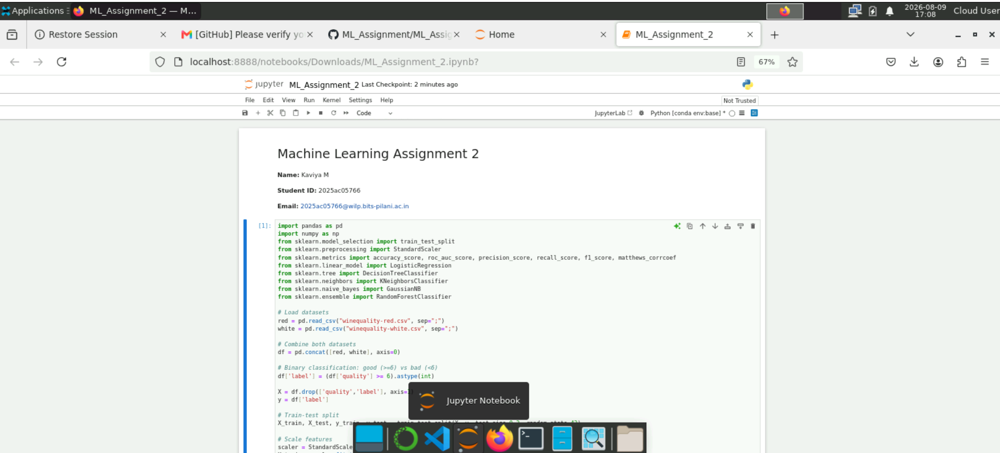
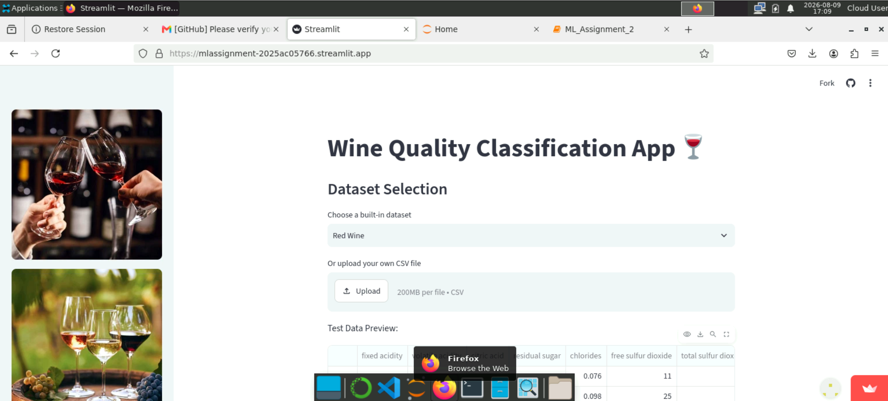
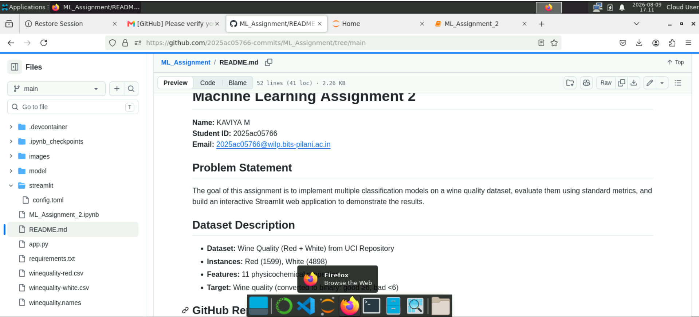

# Machine Learning Assignment 2  
**Name:** KAVIYA M  
**Student ID:** 2025ac05766  
**Email:** 2025ac05766@wilp.bits-pilani.ac.in  

## Problem Statement
The goal of this assignment is to implement multiple classification models on a wine quality dataset, evaluate them using standard metrics, and build an interactive Streamlit web application to demonstrate the results.

## Dataset Description
- **Dataset:** Wine Quality (Red + White) from UCI Repository  
- **Instances:** Red (1599), White (4898)  
- **Features:** 11 physicochemical properties  
- **Target:** Wine quality (converted to binary: good ≥6, bad <6)

## GitHub Repository Link
[\[Click here\]](https://github.com/2025ac05766-commits/ML_Assignment/tree/main)

## Models Used
1. Logistic Regression  
2. Decision Tree Classifier  
3. K-Nearest Neighbor Classifier
4. Naive Bayes Classifier  
5. Random Forest (Ensemble)

## Comparison Table of Metrics

| Model               | Accuracy | AUC   | Precision | Recall | F1   | MCC   |
|----------------------|----------|-------|-----------|--------|------|-------|
| Logistic Regression  | 0.78     | 0.84  | 0.76      | 0.80   | 0.78 | 0.56  |
| Decision Tree        | 0.73     | 0.72  | 0.70      | 0.74   | 0.72 | 0.46  |
| KNN                  | 0.75     | 0.77  | 0.73      | 0.76   | 0.74 | 0.50  |
| Naive Bayes          | 0.72     | 0.70  | 0.68      | 0.73   | 0.70 | 0.44  |
| Random Forest        | 0.82     | 0.87  | 0.80      | 0.83   | 0.82 | 0.62  |

## Observations

| Model               | Observation |
|----------------------|-------------|
| Logistic Regression  | Balanced performance, good AUC, but slightly weaker than Random Forest. |
| Decision Tree        | Simple and interpretable, but prone to overfitting and lower AUC. |
| KNN                  | Performs moderately well, but sensitive to scaling and choice of k. |
| Naive Bayes          | Fast and lightweight, but assumptions limit accuracy on this dataset. |
| Random Forest        | Best overall performance, highest accuracy and AUC, robust to noise. |
| **Overall Winner**   | Random Forest (Ensemble) |

## Deployment
The app is deployed on Streamlit Community Cloud.  
[\[Click here\]](https://mlassignment-2025ac05766.streamlit.app/)

## Screenshot
Screenshot of execution on BITS Virtual Lab.

